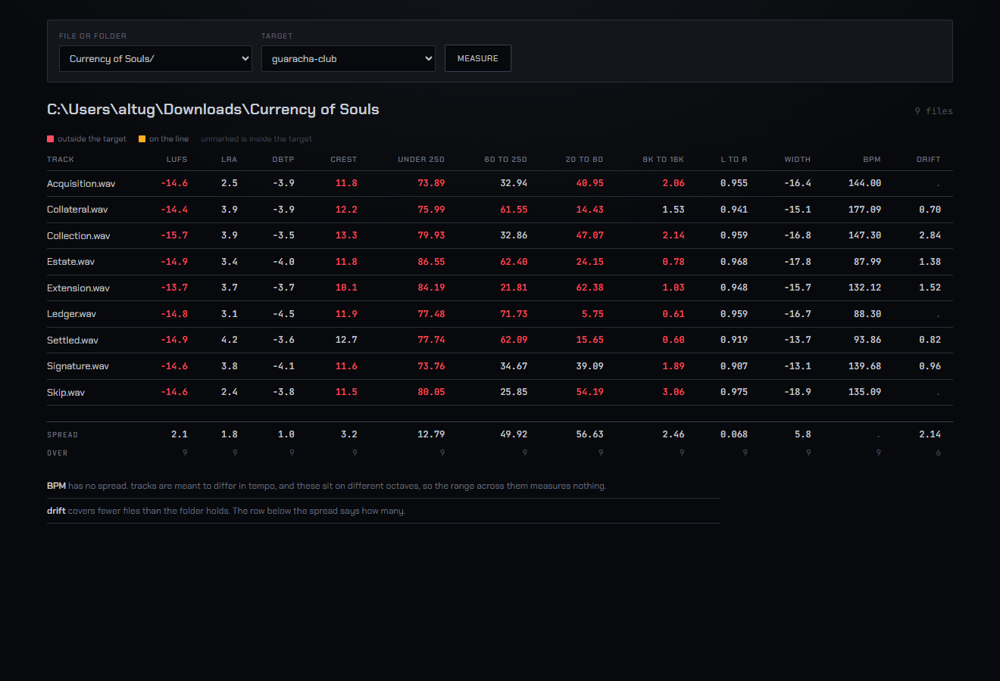
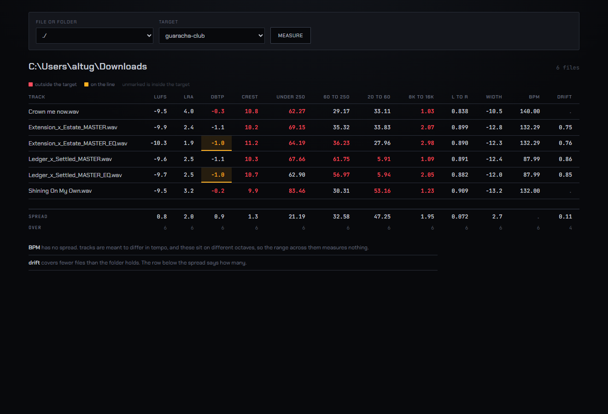

# Bench

A measurement bench for your own masters. Give it a file, it measures it, shows you the
numbers, and will correct it against a target without ever touching what you gave it.

Most tools tell you a master is fine. This one tells you what it measured, how sure it
is, and what it refused to guess.



## What it measures

| | |
| - | - |
| Loudness | Integrated LUFS, loudness range, true peak, sample peak |
| Levels | Crest, gated level, clipped runs, samples over full scale, direct current |
| Spectral | Ten bands as a share of total energy, plus rollups under 250 Hz and 60 to 250 Hz |
| Stereo | Left to right correlation, side over mid width |
| Tempo | Beats per minute with octave alternatives, grid fit, onsets on the grid, movement across the track |
| Source | Container, codec, rate, channels, bit depth, and the rate it was measured at |

Anything it cannot derive is absent, with the reason printed next to the gap. There are
no placeholder values and no filler dashes.

## Four things it does differently

**Loudness is measured twice.** An ffmpeg ebur128 pass and an independent BS.1770-4
implementation in numpy, sharing no code. The bench reports the gap between them rather
than an average, so when the two disagree you find out instead of getting the mean of a
right answer and a wrong one.

**Uncertainty reaches the verdict.** Every measurement carries its own uncertainty, and
a value whose interval touches a boundary is reported as on the line, not as a pass.
True peak carries three sources of it: the rounding of the primary instrument, the gap
between the two instruments, and the oversampling filter length.

**It refuses instead of guessing.** Percentages taken under different band edges are
different quantities, so comparing them raises rather than warns. A field with no
uncertainty cannot be placed against a target at all. A tempo peak that lands on the
edge of the search range is reported as what it is, a truncation, with a caveat saying
the range chose the octave.

**Targets say what they rest on.** A profile is a data file that records how many
references it came from, whether those sources were lossy, and which fields it will not
claim. The guaracha profile ships with five fields withheld and their reasons, because
two lossy references cannot tell you where a true peak ceiling is.



Two masters sitting on a -1.0 dBTP ceiling. Neither is reported as passing.

## Folder mode

Point it at a record and get one table, with a spread per column and the number of files
that spread covers. A spread over eight of nine files is not the spread of a record, and
the table says so.

On a nine track album this found a 49.92 point spread in the 60 to 250 Hz band, from
21.81 to 71.73. That is not a mastering difference. Those tracks are built differently,
and nothing else showed it.

## The page

Runs on your machine and stays there. A test asserts the page contains no external
address, no script tag and no import, and the two faces are served from the same
process.

Colour is a warning, not decoration. A value inside its target gets no colour, because
not being marked is the signal. Only what is outside is coloured, and on the line gets
its own treatment because it is rare and it decides whether something ships.

Two buttons. Measure reads, and Master writes, so Master is the only thing here that is
a post rather than a link, and the bar says where it would write before you press it. It
runs in the background and the page keeps itself up to date while it works, without a
line of script on it.

A mastered file reads as one block: the plan across the top, the source and the master
drawn one above the other at the same scale, and the field table beside the spectral
balance. While a run is working that block is already on the page with nothing in it,
at the size it will be, so nothing moves when the numbers land. A folder gets one block
per file.

## measuring.md

32 write ups of measurements that were wrong, or of claims about them that
were. Every one passed its own check at the time. It is the most useful file here.

A peak read as decibels when it was linear amplitude, which said a master was under the
ceiling while it was nearly 4 dB over. A drift range read at two endpoints, exactly zero
for any tempo that returns to where it started, so a track moving 6 BPM printed as
steady. A search range that was an octave prior with nothing saying so. A limiter search
that reported twelve of twelve settings passing a test none of them could fail. Four
mechanisms that stopped doing what the documentation claimed and passed every test
anyway.

Each entry says what the instrument reported, what was true, how it was caught, and what
now stops it coming back.

## Running it

Needs Python 3.10 or newer, and ffmpeg and ffprobe on the path.

```
pip install -e ".[dev]"
python tools/serve.py "path/to/your/folder"
```

Then open http://127.0.0.1:8731

## Tests

302 tests. Every measurement claim has a control that can fail, and a negative control
proving the check has teeth. The rig raises a distinct error when an assertion accepts
something it was supposed to reject.

```
python -m pytest
python tools/mutate.py
```

The mutation tool breaks the code 62 ways and checks the suite notices, working on a
copy of the tree rather than the tree itself. All 62 are caught. It has found faults a
green suite cannot, and seven of the ledger entries came from it, including three tests
that were passing for reasons unrelated to what they were written for.

```
python tools/midiset.py
```

Known answer material for tempo, built by writing a tempo map into a MIDI file,
rendering it through the General MIDI samples that ship with Windows, and reading the
map back out of the file. The answer comes from the artifact, not from the generator.

## Mastering

A fourth layer, reading the same measurement and the same target as everything else and
changing neither. Every correction is a number the measurement implies: a low cut only
when there is something under 20 Hz to remove, a gain from the distance to the target,
a ceiling from the target's own limit. What the measurement does not imply is not
applied, and the plan says which corrections were refused and why.

The limiter is the exception, because an attack and a release are not implied by
anything. They are searched for over 36 settings, and the winner is the one whose output
keeps every band's verdict against the target while moving the balance least. The plan
says how wide the spread was that it chose out of, and says so when the winner sits on
the edge of the grid, because a peak at the edge of a search is a truncation.

That objective has a fault worth knowing about before trusting the setting it picks.
Entry 34 has the measured surface: a limiter with an infinitely long release is a
constant gain, and a constant gain moves no band at all, so the thing being minimised
has its best value where the limiter does nothing dynamic.

Master on the page does this for whatever is selected, writing into a folder beside it.
From the terminal:

```
python tools/master_folder.py "path/to/folder" boom-bap "somewhere else"
```

It never writes over an input. The output folder cannot be the folder the source is in,
an existing master is never replaced, and a test hashes the input before and after to
prove the file it read is the file it left. It measures what it wrote, checks it against
what it predicted, and prints the verdict either side.

## Scope

It measures, it reports, and it corrects against a target. It will not tell you what to
change, and nothing it does is undone for you: the source file is never the file it
writes.
